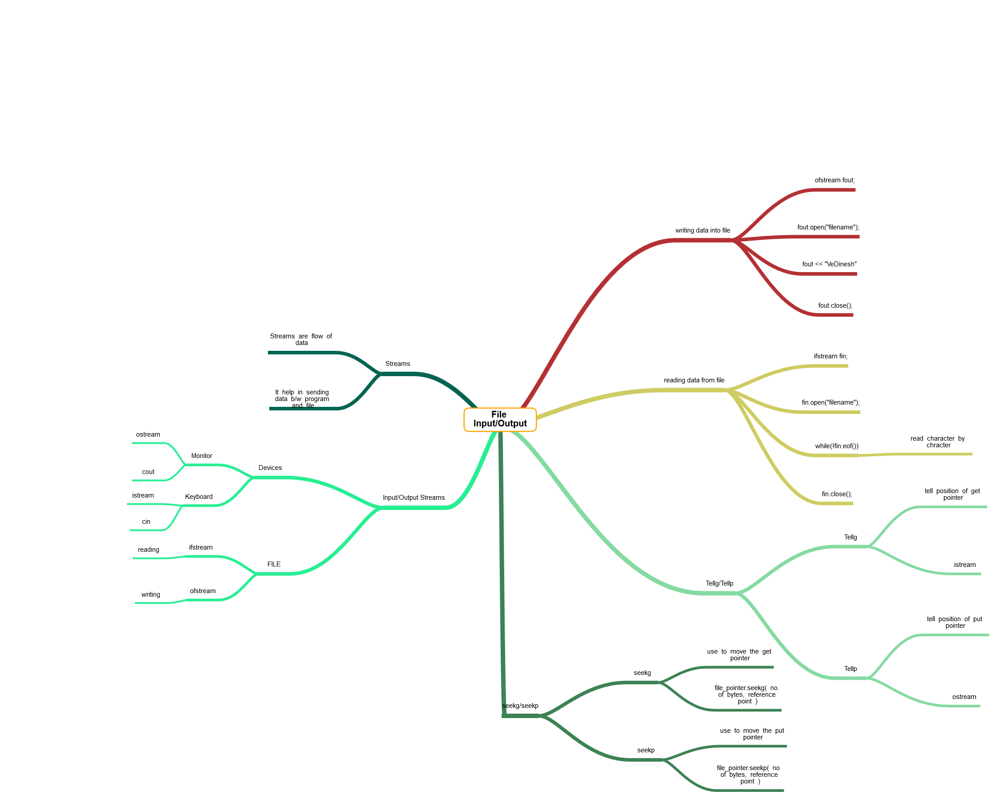
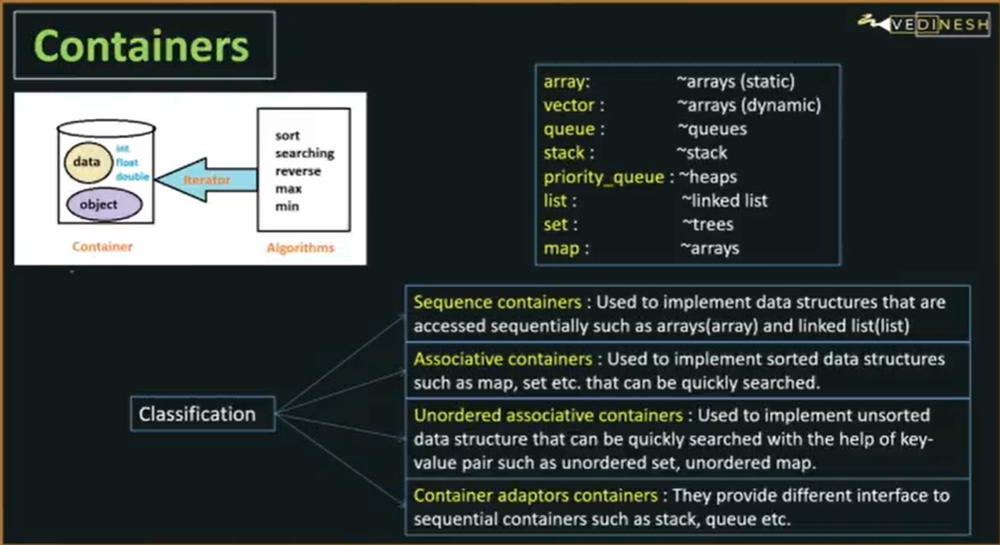

# class Declaration:
```
class CLASSAME{
        public:
            ...
        private:
            ...
}
```

# using `static` member variable :
- It is visible only with in the class but its life time is the entire program.
- Static variables are normally used to __maintain values common to the entire class__.
- Only one copy of that member is created for the entire class and is shared by all the objects of that class, no matter how many objects are created.

# using `static` member functions :
- A static function can have access to only other static members declared in the same class.
- A static member function can be called using the class name as follows :
        👉 className::StaticFunctionName();

# object as a function argument:
    pass-by-value : A copy of the entire object is passed to the function.
    pass-by-referance : Only the address of the object is transferred to the function.

# friendly function  using `friend` keyword :
- A friend function not a member function , has full access rights to the private members of the class.
- is not in the scope of the class, it cannot be called using the object of that class.

# using pointeur to member :
- take the address of a member of a class and assign it to a pointer.
- The address of a member can be obtained by applying the operator `&` to a class member name.
> Example :
```
class A{
    private :
        int i;
    public :
        void show(void);
}
```
>
- ___a pointer to a member variable can be declared as above :___
  - We can define a pointer to the member `i` as follows :
    -  👉 int A::*ip=&A::i
    - The phrase `A :: *` means “pointer - to - member of a class” . The phrase `&A::i` means the “Address of the i member of a class”
  
- ___a pointer to a member function can be declared as above :___
  - (object-name .* pointer-to-member function)
  - (pointer-to-object -> * pointer-to-member function)
    - 💁 the parenthesis are necessary.
# using `constructor` in definition of class :
> constructor is a special member function whose task is to initialize the objects of its class:
- They should be declared in the public section .
-  They are invoked automatically when the objects are created.
-  They don't have return types, not even void and therefore they cannot return values.
-  They cannot be inherited , though a derived class can call the base class constructor.
-  An object with a constructor can't be used as a member of union.
>   The constructors can also be used to allocate memory while creating objects .
>   This will enable the system to allocate the right amount of memory for each object when the objects are not of the same size, thus resulting in the saving of memory. 
> Allocate of memory to objects at the time of their construction is known as dynamic constructors of objects
# using `destructor` in definition of class :
```
class MyClass{
    MyClass(){};
    ~MyClass(){};
};
```
# using `operator overloading` :
> define a operator overloading:
- To define an additional task to an operator, we must specify what it means in relation to the class to which the operator is applied.
- This is done with the help of a special function called operator function.
```
return-type class-name :: operator op( arg-list)
{//function body}
```
> - operator overloading(using member function) 
> - operator overloading(using friend function)
# `single-inheritance` :
```
class Child : public Parent{
    ...
}
class Child : protected Parent{
    ...
}
class Child : Parent{
    ...
}
```
- ***Private***: when a base class is privately inherited by a derived class, 'public members' of the base class become private members of the derived class and therefore the public members of the base class can be accessed by its own objects using the dot operator. The result is that we have no member of base class that is accessible to the objects of the derived class.
- ***Public***: On the other hand, when the base class is publicly inherited, 'public members' of the base class become 'public members' of derived class and therefore they are accessible to the objects of the derived class.
- ***Protected***: C++ provides a third visibility modifier, protected, which serve a little purpose in the inheritance. A member declared as protected is accessible by the member functions within its class and any class immediately derived from it. It cannot be accessed by functions outside these two classes.
# `multilevel-inheritance`:
class A serves as a base class for a derived class B which in turn serves as a base class for the derived class C. This type of inheritance is called "MULTILEVEL INHERITENCE". The class B is known as the "INTERMEDIATE BASE CLASS" since it provides a link for the inheritance between A and C. The chain ABC is called "ITNHERITENCE*PATH".
# `multiple-inheritence` :
> a class can inherit the attributes of two or more classes. this mechanism is known as "multiple inheritence".
```
class base1{
    ...
}
class base2{
    ...
}
class derived : visibility base1, visibility base2
{
    ...
}
```
# `hierarchical-inheritence` :
- 
# `hybrid-inheritence` :
-  Applying two or more types of inheritance to design a program .
# `virtual-base-class` :
-  A situation which would require the use of both multiple and multi level inheritance. Consider a situation, where all the three kinds of inheritance, namely ___multi-level___, ___multiple___ and ___hierarchical___ are involved.
-  Let us say the 'child' has two direct base classes **parent1** and **parent2** which themselves has a common base class **grandparent**. The child inherits the traits of **grandparent** via two separate paths. It can also be inherit directly as shown by the broken line. The grandparent is sometimes referred to as **INDIRECT BASE CLASS**. Now, the inheritance by the child might cause some problems. All the public and protected members of **grandparent** are inherited into **child** twice,first via **parent1** and again via **parent2**. So, there occurs a duplicacy which should be avoided.
-  The duplication of the inherited members can be avoided by making common base class as the virtual base class.
```
class g_parent
{
//Body
};
class parent1: virtual public g_parent
{
// Body
};
class parent2: public virtual g_parent
{
// Body
};
class child : public parent1, public parent2
{
// body
};
```
# Containership in C++ :
> When a class contains objects of another class or its members, this kind of relationship is called containership or nesting and the class which contains objects of another class as its members is called as container class.
```
Class class_name1
{
    //body
};
Class class_name2
{
    //body
};
Class class_name3
{
Class_name1 obj1;
Class_name2 obj2;
//body
};
```
# Difference between Inheritance and Containership :
- ***Containership***: containership is the phenomenon of using one or more classes within the definition of other class. when a class contains the definition of some other classes, it is referred to as composition, containment or aggregation. the data member of a new class is an object of some other class. thus the other class is said to be composed of other classes and hence referred to as containership. composition is often referred to as a ___has-a___ relationship because the objects of the composite class have objects of the composed class as members.
- ***Inheritance***: inheritance is the phenomenon of deriving a new class from an old one. inheritance supports code reusability. additional features can be added to a class by deriving a class from it and then by adding new features to it. class once written or tested need not be rewritten or redefined. inheritance is also referred to as specialization or derivation, as one class is inherited or derived from the other. it is also termed as ___is-a___ relationship because every object of the class being defined is also an object of the inherited class.

# File Handling : `File Input / Output`




# Exception  Handling : 💁


# Standart Template Library =====> STL : 🚀 

## 🎯 Containers : 



## 🎯 Array  : 

> Arrays are fixed-size sequence containers
Therefore, they cannot be expanded or contracted dynamically


properties:-
1. `Sequence:`:- Elements in container follow strict linear sequence.
			  Individual elements are accessed by their position 
			  in this sequence.

2. `Contiguous storage:`:- The elements are stored in contiguous memory
						locations.

3. `Fixed-size aggregate`:
> The container uses implicit constructors and destructors to allocate the required space.
- Explicitly Constructor call
 ```test obj = test(10);```
- Implicitly Constructor call
```test obj(10)```


## 🎯 Vector   : 


> 📌 Vector declaration : 

`std::vector<int> testVector1; `

> 📌 Vector declaration : 

Insertion of an element at the end of the vector : `testVector2.push_back(40);	 `

> 📌 Iteration for printing values of vector : 
```
for (vector<int>::iterator i = testVector2.begin(); i != testVector2.end(); i++)
{
		cout << *i << " ";   // for printing the vector
}
```

> 📌 Pop out last element : 

`testVector2.pop_back(40); `

> 📌 insert: - inserts the element in vector before the position pointed : 
```
vector<int>::iterator i = testVector2.begin();
testVector2.insert(i, 0);
```

> 📌 erase:- removes the element pointed by the iterator : 

```
vector<int>::iterator j = testVector2.begin();
	testVector2.erase(j);
```

> 📌 erase all element except last element :

`testVector2.erase(testVector2.begin(), testVector2.end() - 1);`

> 📌 swap: interchanges value of two vectors :

`testVector2.swap(testVector1);`

> 📌 capacity :number of elements that can be inserted in the vector based on the memory allocated to the vector : 

`cout << endl << "Capacity " << testVector2.capacity() << endl; ` 

## 🎯 List   : 


